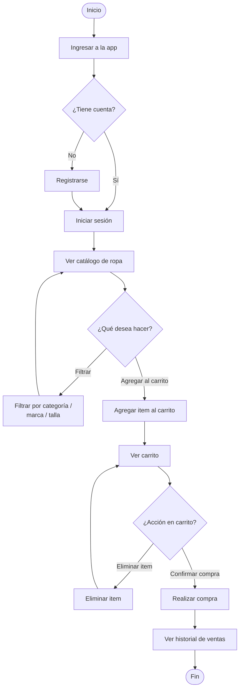
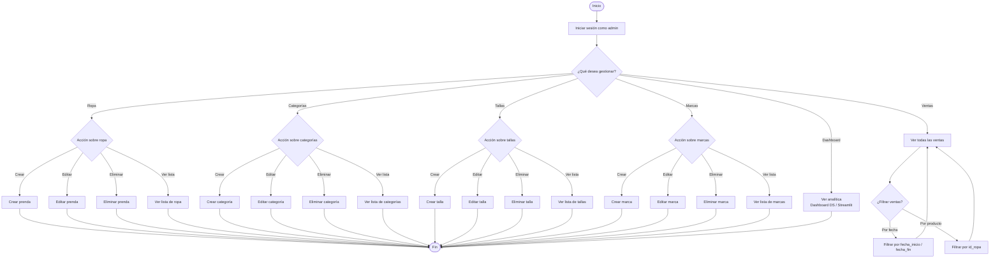

# Requerimientos del Proyecto

## Stack Tecnológico

### Frontend
- Next.js
- TypeScript
- Tailwind CSS
- Axios
- Zustand
- Chart.js
- Node.js

### Backend
- Python
- FastAPI
- SQLModel
- Redis
- JWT

### Data Science
- Streamlit
- Pandas
- Matplotlib
- Seaborn
- Scikit-learn
- NumPy
- MLflow
- PostgreSQL
- Python

### Docker
- MLflow
- MinIO
- PostgreSQL
- Node Alpine
- Python Slim
- Streamlit

## Flujo de Trabajo

### Git Flow
- **Rama principal:** Main
- **Rama secundaria:** Develop
- **Ramas de feature:** `{número}-feature`
- **Ramas de corrección:** `fix`

### Pull Requests
- `feature` → `develop`
- `fix` → `main`
- `develop` → `main`

**Commits:** Usar Conventional Commits

### Conventional Commits
- `feat` - Nueva característica
- `fix` - Arreglo de error
- `docs` - Agregar documentación
- `chore` - Tarea de mantenimiento, comentarios o estilo de código

## Lógica del Negocio: Tienda de Ropa

### Funcionalidades Usuario
- Ver catálogo de ropa
- Agregar/eliminar items al carrito
- Comprar productos individuales
- Comprar carrito completo

### Funcionalidades Administrador
- CRUD de ropa, tallas, categorías y marcas
- Ver y filtrar ventas (por fecha/producto)
- Dashboard de analítica

---

## Flujo de Usuario

---

## Flujo de Administrador

## Esquema de Base de Datos

| Tabla | Campos |
|-------|--------|
| **usuario** | id, nombre, correo, clave, es_admin (default: false) |
| **marca** | id, nombre, fecha_creado, eliminido(default false)|
| **categoria** | id, nombre,fecha_creado, eliminado(default false) |
| **size** | id, nombre, fecha_creado, eliminado(default false) |
| **ropa** | id, id_categoria, id_marca, id_size, ruta_foto, precio_venta, precio_compra, cantidad, descripcion, fecha_creado, fecha_actualizacion, eliminada (default false) |
| **venta** | id, id_usuario, total, fecha_creado |
| **detalle_venta** | id, id_venta, id_ropa, precio, descuento, cantidad, total |
| **carrito** | id, id_usuario, id_ropa, cantidad, fecha_creacion |

## API Endpoints

### Usuario
- `POST /api/register` - Registrar nuevo usuario
- `POST /api/login` - Iniciar sesión

### Ropa
- `GET /api/ropa` - Listar ropa (con filtros por categoría, marca, talla)
- `POST /api/ropa` - Crear nueva prenda (admin)
- `PUT /api/ropa/{id}` - Actualizar prenda (admin)
- `DELETE /api/ropa/{id}` - Eliminar prenda (admin)

### Carrito
- `POST /api/carrito` - Agregar item al carrito
- `GET /api/carrito` - Ver carrito del usuario
- `DELETE /api/carrito/{id}` - Eliminar item del carrito

### Venta
- `POST /api/ventas` - Realizar compra (procesar carrito)
- `GET /api/ventas` - Ver ventas del usuario
- `GET /api/ventas/admin` - Ver todas las ventas (admin)

### Categoría
- `GET /api/categorias` - Listar categorías(admin)
- `POST /api/categorias` - Crear nueva categoría (admin)
- `PUT /api/categorias/{id}` - Actualizar categoría (admin)
- `DELETE /api/categorias/{id}` - Eliminar categoría (admin)

### Size
- `GET /api/sizes` - Listar tallas(admin)
- `POST /api/sizes` - Crear nueva talla (admin)
- `PUT /api/sizes/{id}` - Actualizar talla (admin)
- `DELETE /api/sizes/{id}` - Eliminar talla (admin)

### Marca
- `GET /api/marcas` - Listar marcas(admin)
- `POST /api/marcas` - Crear nueva marca (admin)
- `PUT /api/marcas/{id}` - Actualizar marca (admin)
- `DELETE /api/marcas/{id}` - Eliminar marca (admin)

## Dashboard de Analítica
- Total de ventas por día/semana/mes
- Productos más vendidos
- Ingresos totales por período
- Análisis de tendencias de compra

## Vistas
- **Home:** Catálogo de ropa con filtros
- **Producto:** Detalles de cada prenda
- **Login/Register:** Formulario de autenticación
- **Compra:** Proceso de compra de productos
- **Carrito:** Detalles del carrito
- **Admin:** Gestión de productos, categorías, tallas, marcas y ventas
- **Analytics:** Visualización de métricas y tendencias de ventas

